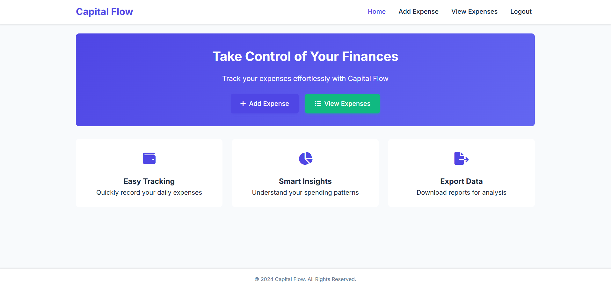

# Expense Management System - Capital Flow



Capital Flow is a simple yet powerful expense management system that helps users track their daily expenses, categorize spending, and generate reports. Built with HTML, CSS, and JavaScript, this web application stores data locally in the browser.

## Features

- **User Authentication**: Sign up and login system
- **Expense Tracking**: Add expenses with details like amount, category, date, and time
- **Expense Management**: View, search, and delete expenses
- **Data Export**: Export expense data to CSV format
- **Responsive Design**: Works on both desktop and mobile devices
- **Local Storage**: All data is stored in the browser's localStorage

## Technologies Used

- **Frontend**: HTML5, CSS3, JavaScript
- **Icons**: Font Awesome
- **Fonts**: Google Fonts (Inter)
- **No external dependencies**: Pure vanilla JavaScript implementation

## Getting Started

### Prerequisites

- Modern web browser (Chrome, Firefox, Safari, Edge)
- No server required - runs entirely client-side

### Installation

1. Clone the repository:
   ```bash
   git clone https://github.com/your-username/capital-flow.git
   ```
2. Navigate to the project directory:
   ```bash
   cd capital-flow
   ```
3. Open `index.html` in your browser to start using the application.

## File Structure

```
capital-flow/
├── index.html              # Main application entry point
├── login.html              # Login page
├── signup.html             # User registration page
├── add-expense.html        # Add new expense page
├── view-expense.html       # View and manage expenses page
├── scripts/
│   ├── login.js            # Login functionality
│   ├── signup.js           # User registration
│   ├── add-expense.js      # Add expense functionality
│   ├── view-expense.js     # View and manage expenses
│   └── main.js             # Shared functionality
├── styles/
│   ├── modern.css          # Main stylesheet
│   └── style.css           # Additional styles
└── users.json              # Sample user data storage
```

## Usage

1. **Sign Up**: Create a new account by providing your details
2. **Login**: Access your expense dashboard
3. **Add Expenses**: Record your daily expenses with categories
4. **View Expenses**: See all your expenses in a clean table view
5. **Search**: Quickly find specific expenses
6. **Export**: Download your expense data as CSV for further analysis

## Screenshots


## Limitations

- Data is stored locally in the browser (cleared if cache is cleared)
- No server-side persistence
- No data backup functionality

## Future Improvements

- Add charts for expense visualization
- Implement budget tracking
- Add multi-user support with cloud storage
- Dark mode support
- Expense categorization reports

## Contributing

Contributions are welcome! Please fork the repository and create a pull request with your changes.

## License

This project is licensed under the MIT License - see the [LICENSE](LICENSE) file for details.

## Acknowledgments

- Inspired by personal finance management needs
- Built with vanilla JavaScript to demonstrate client-side capabilities
- Thanks to all open source contributors whose work inspired this project
